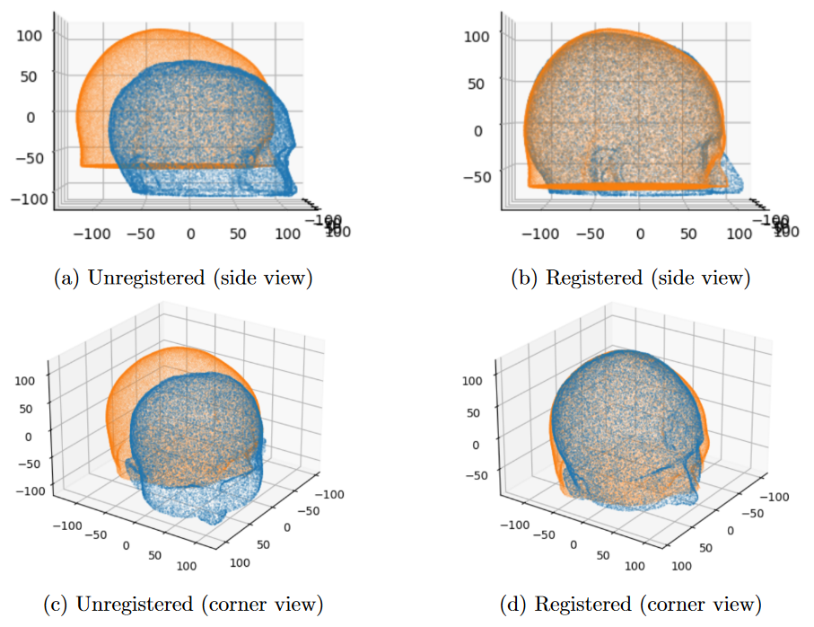
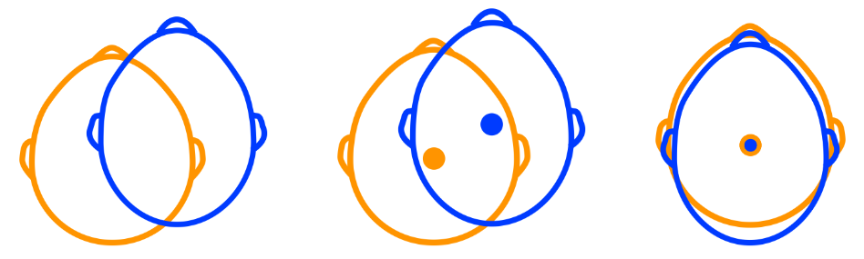

# Browser-Based 3D Visualisation of Brain Activation and Point Cloud Registration

Demo video can be found [here](https://youtu.be/Drjh7nEQX_M)

# Preview
This is the web app component of the Final Year Dissertation Project. It is an app where a researcher can visualise a subject model reconstruction and register it to the atlas by simply dragging and dropping the file containing the 3D scan, without having to write code or use the terminal. The web app also allows the researcher to drag and drop a file containing a time series, representing the haemodynamic response as a function of time. The researcher can then use a slider to visualise the recon- struction of the response on subject-specific anatomy over time dynamically. To improve the user experience, usability testing was conducted to identify potential issues and learn about the researchers’ needs.

# Process
First, various 3D Models of the subject are generated. These will be used later in the process of registration and anatomy approximation and rendering.

Then, an Atlas is registered on the subject's mesh following two different techniques: ICP and SVD.

Three Evaluation Methods were employed to determine which technique is yielding superior results.

#  Web App

