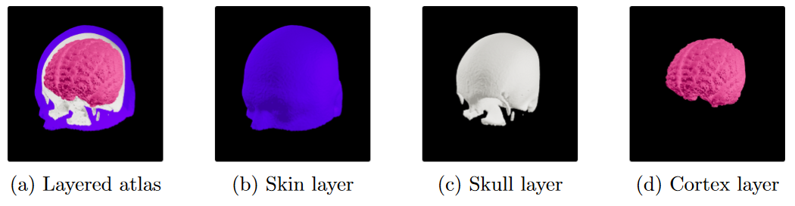
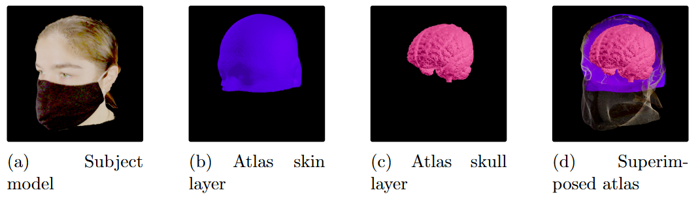
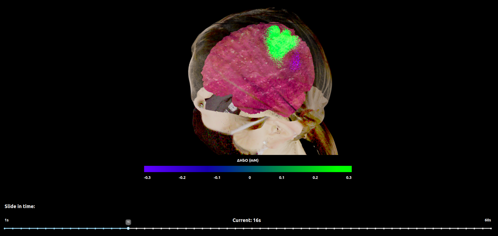
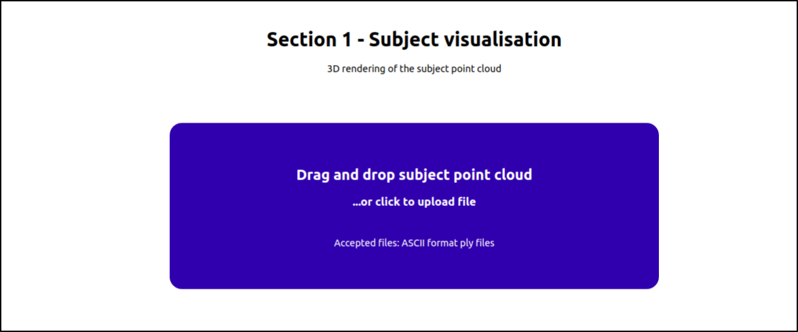
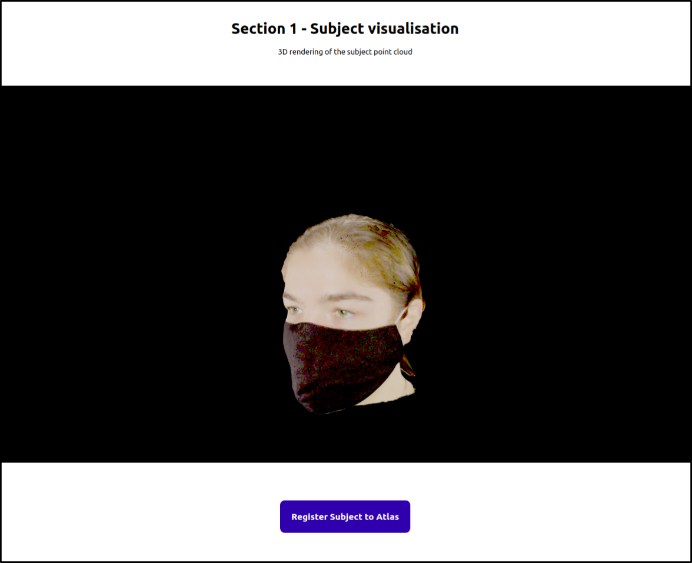
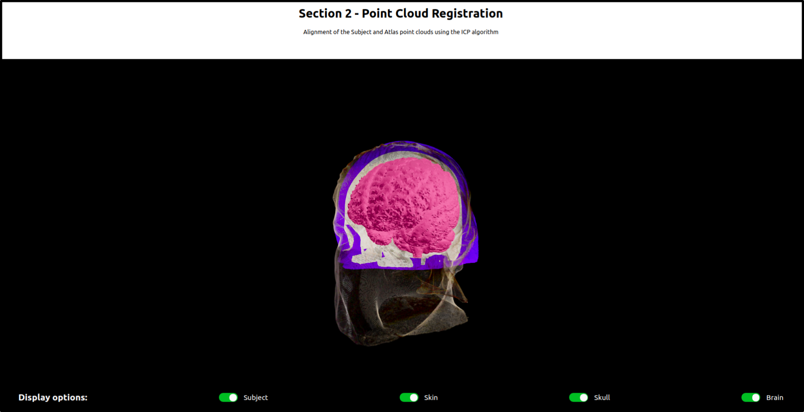
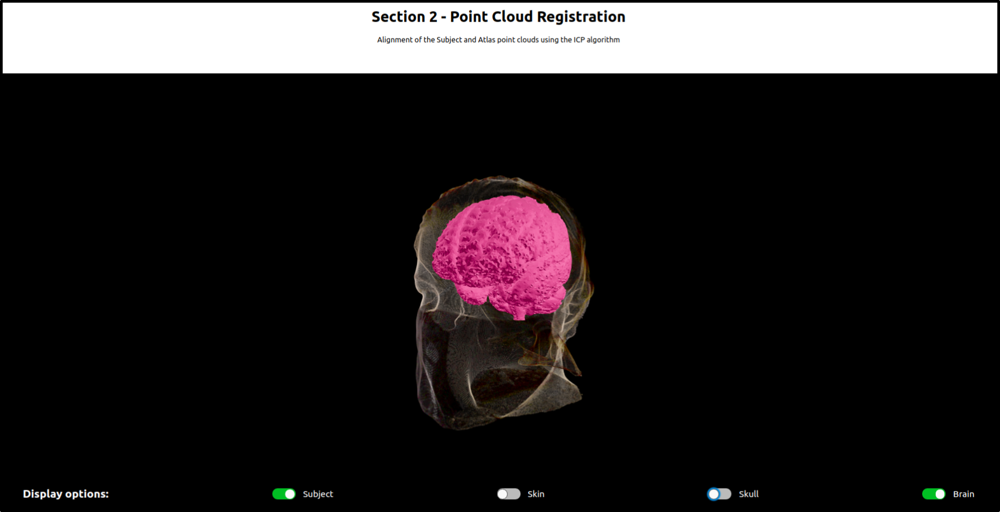
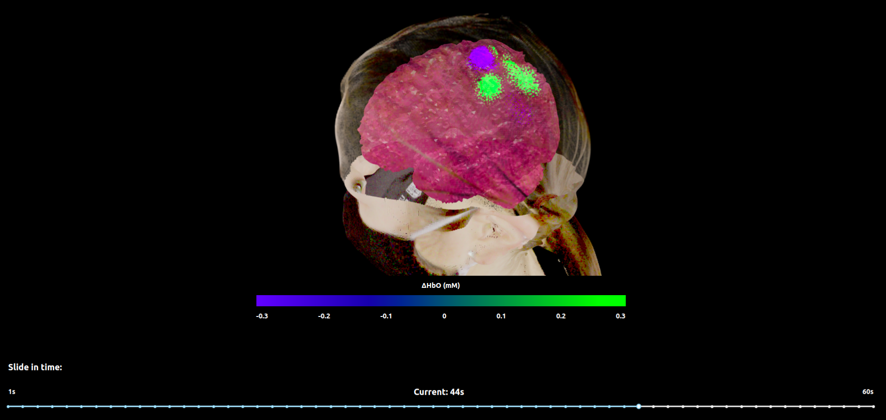
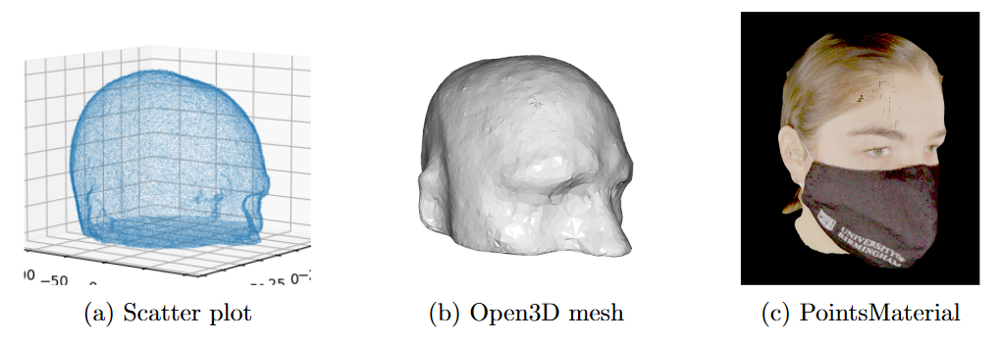
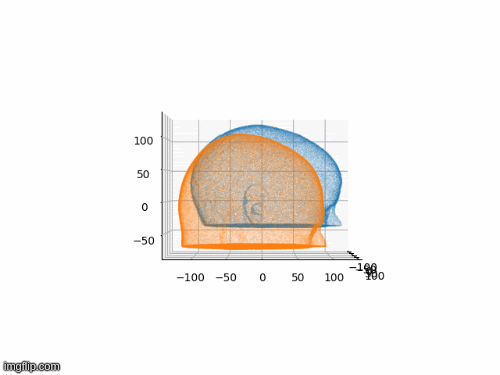

# Browser-Based 3D Visualisation of Brain Activation and Point Cloud Registration

Demo video can be found [here](https://youtu.be/Drjh7nEQX_M)

# Preview
This is the web app component of the Final Year Dissertation Project. It is an app where a researcher can visualise a subject model reconstruction and register it to the atlas by simply dragging and dropping the file containing the 3D scan, without having to write code or use the terminal. The web app also allows the researcher to drag and drop a file containing a time series, representing the haemodynamic response as a function of time. The researcher can then use a slider to visualise the reconstruction of the response on subject-specific anatomy over time dynamically. To improve the user experience, usability testing was conducted to identify potential issues and learn about the researchers’ needs.

The app was created using Flask, React and Three.js.

#  Web App

First, a Wireframe was generated using Balsamiq.

### Section 1
In section one, the user can drag-and-drop a PLY file containing the subject 3D scan.

### Section 2
The app then registers an Atlas onto the 3D model and the user can select the different anatomy layers to show on the model.

### Section 3
Then finally in section three, the user can drag-and-drop a file containing time series data of the subject's brain activation during simple phyisical activities such as forming a fist. The user can then drag the slider to view the brain activation over time.

# Registration Process
First, various 3D Models of the subject are generated. These will be used later in the process of registration and anatomy approximation and rendering.

Then, an Atlas is registered on the subject's mesh following two different techniques: ICP and SVD.

Three Evaluation Methods were employed to determine which technique is yielding superior results. This method is then used in the Web App.